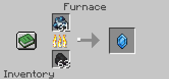
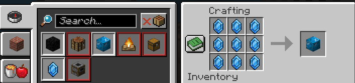

# Naruto Mods - Minecraft: Java Edition (Forge 1.20.1)
## Made by Surya Gedipudi
### Contains the following:
#### Items:
- Eye of Kurama (Icon for creative mode tab)
- Rinnegan (will later be used for Ender Pearl)
- Chakra Crystal
- Pure Chakra
#### Blocks:
- Block of Chakra
- Chakra Ore
#### Recipes:
1. Smelting(and Blasting) Pure Chakra into Chakra Crystal:
- 
3. In the crafting table, click the green book icon to see the recipes for crafting chakra crystals, chakra blocks, etc:
- 
#### Other:
- Additional creative mode tab